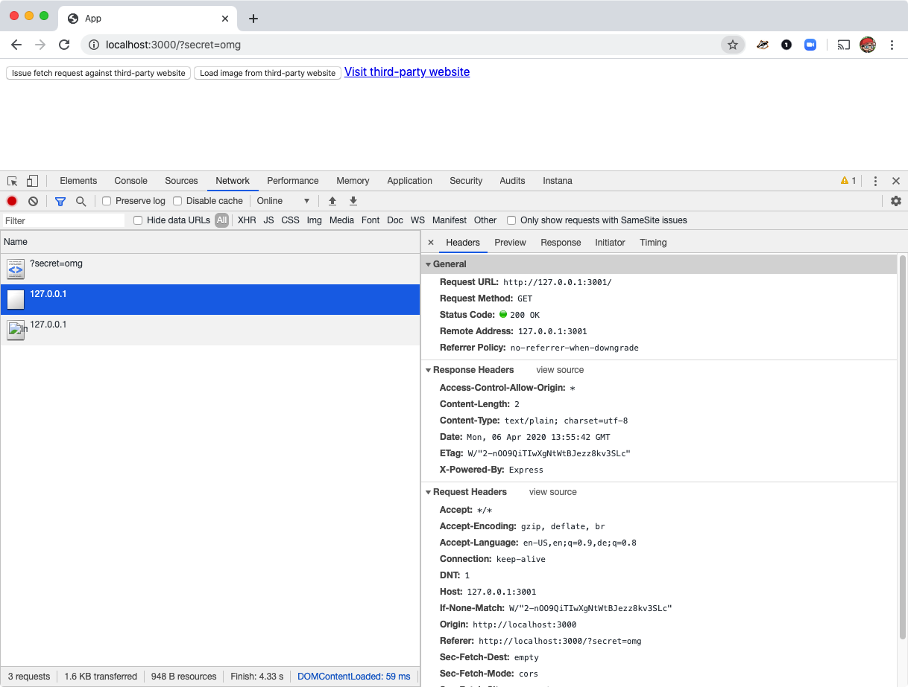
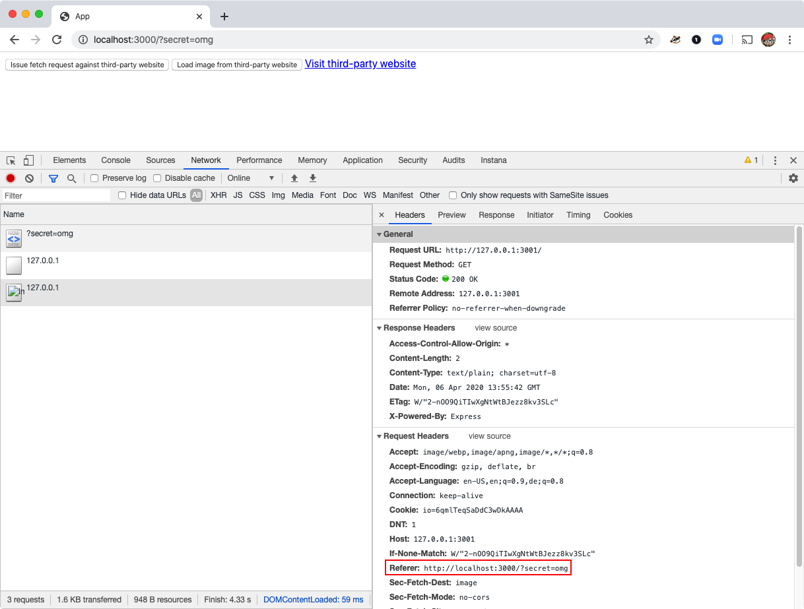

# Referer Security Leaks

This example shows that information stored in the URL is easily
leaked to third-parties, e.g. advertisement providers, CDNs,
social networks etc. This information leakage happens via the
[Referer header](https://developer.mozilla.org/en-US/docs/Web/HTTP/Headers/Referer).

Generally no secrets should ever be stored in the document URL as
these are easily leaked. Even when protective measures are taken, e.g.
when a [Referer-Policy](https://developer.mozilla.org/en-US/docs/Web/HTTP/Headers/Referrer-Policy)
header is added, secrets in the URL continue to pose a threat, e.g.
because a piece of JavaScript from an advertisement provider can just
grab the secret from the URL.

## Why this example exists

At Instana we occasionally receive reports that we collect secrets from
document URLs. We get these reports because our customers can easily see
collected document URLs within our product. These reports are then
typically accompanied by a feature request to implement a secret stripping
mechanism for document URLs.

While such a mechanism would allow our customers to strip secrets from data
reported to Instana, this would not fix the security issues they face, because
all other third-parties would continue to receive the secrets! Instead we
choose an educational approach through this example.

## Information leaked to third-parties for fetch requests



## Information leaked to third-parties for resources



## Information leaked to third-parties during navigation


## Running Locally

```
git clone https://github.com/instana/website-monitoring-examples.git
cd website-monitoring-examples/examples/secret-leaks-query-param

# in a console tab
cd app
npm install
node .

# in another console tab
cd third-party
npm install
node .

# Open the example in the browser
open 'http://localhost:3000/?secret=omg'
```
